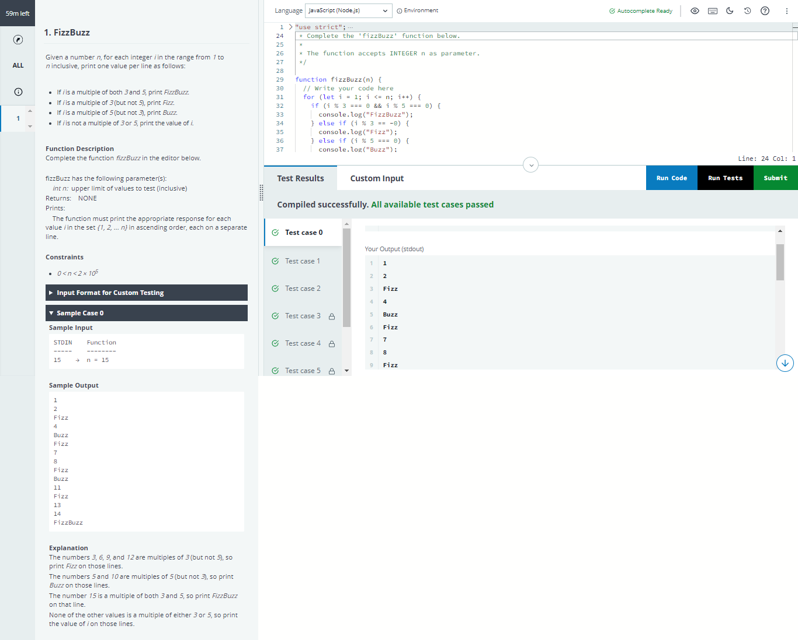
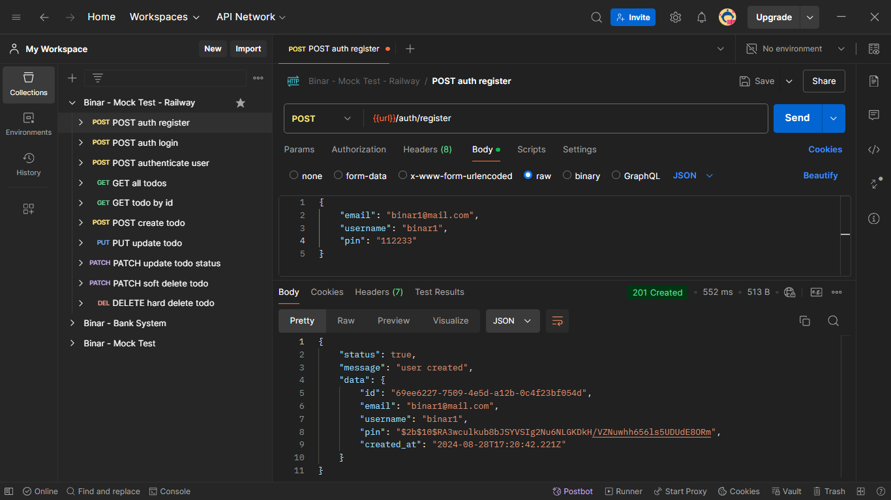
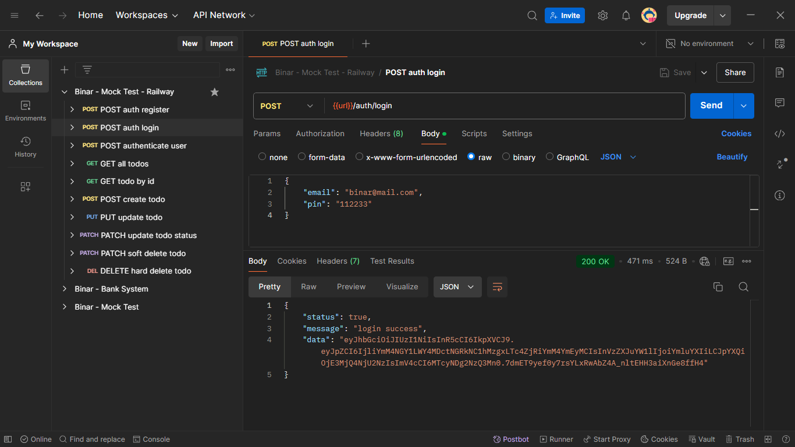
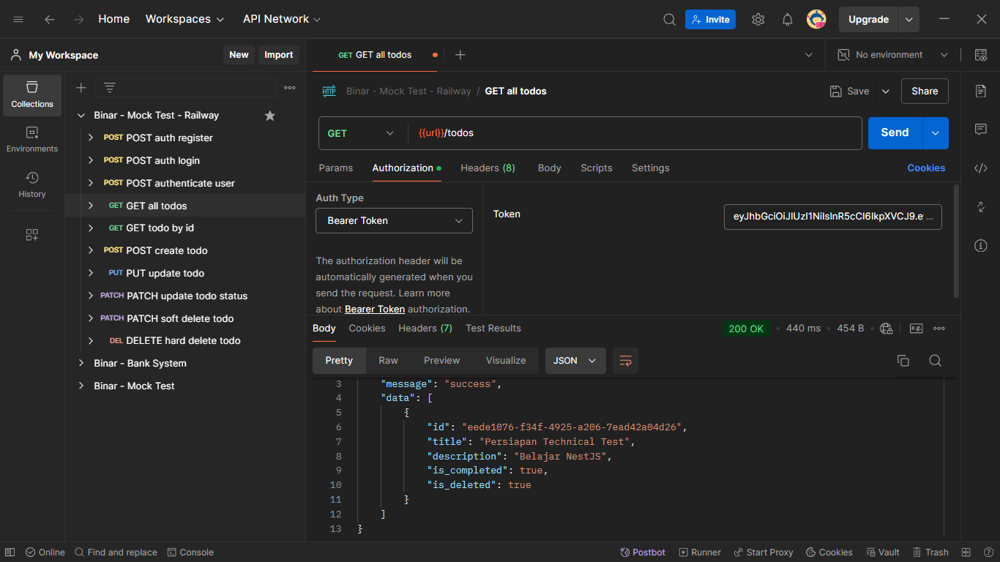
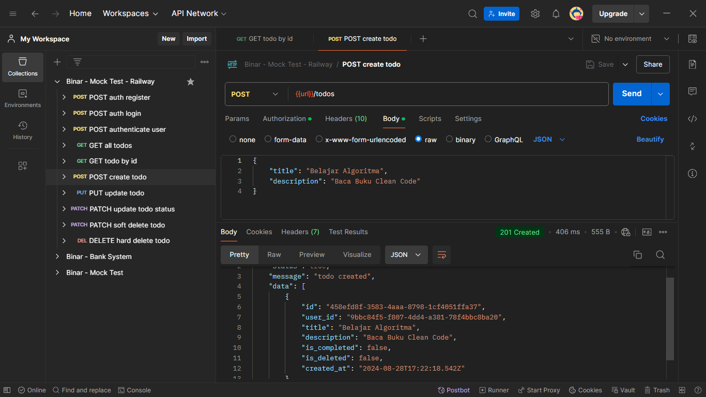
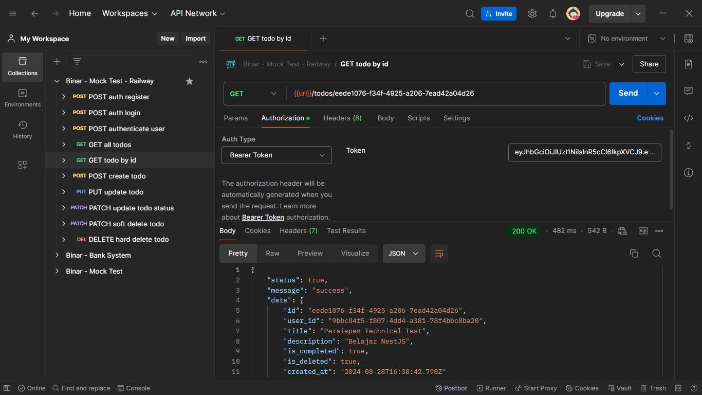
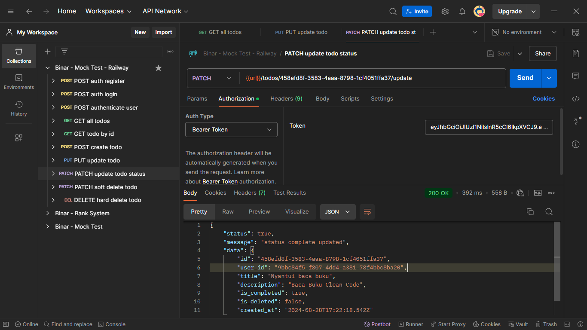
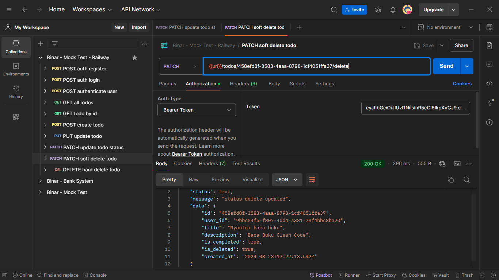
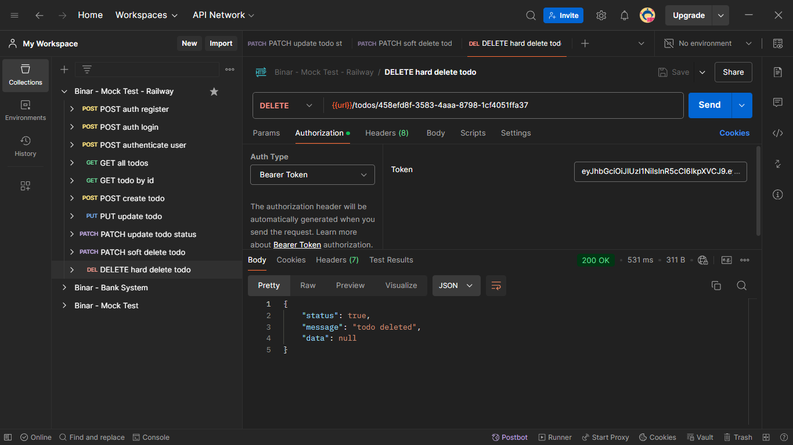

#  Binar Backend JavaScript Bootcamp Batch 2 - FSW Mock Test (Backend)

This repository is part of my Binar Backend JavaScript Bootcamp Batch 2 - FGA 2024.

This simple todo-list REST API is a mock test to show my skills on Node.JS and Express.

### This project using tech stacks :

Node.JS, Express, PostgreSQL, Postman, JWT, and Joi

For accessing database I use simple raw query to enhance my SQL skill.

## Algorithm Mock Test

Check algorithm-mock-test directory to check my solving code for this [Algorithm Mock Test](https://www.hackerrank.com/test/143hd7jsid6/questions)


## Pertanyaan Mock Test

_1. Apakah Kegunaan JSON pada REST API?_

> JSON (JavaScript Object Notation) pada REST API berguna sebagai format pertukaran data antara browser atau client yang memiliki keunggulan ringan dan mudah dibaca dibandingkan format lain.

_2. Jelaskan bagaimana REST API bekerja_

> REST API bekerja berdasarkan komunikasi HTTP dan request dibedakan berdasarkan HTTP methods (GET, POST, PUT, DELETE, dll) yang dikirimkan oleh sisi client yang nantinya akan diproses di sisi server untuk memberikan response berdasarkan request yang diminta. Response yang dikirim biasanya dalam format JSON.

## Showcase

Base URL for this project :

```
https://binar-mock-test-jhontriboyke-production.up.railway.app
```

## How to Login

### Register

Access this url first to create new user with :

```
Method: POST

https://binar-mock-test-jhontriboyke-production.up.railway.app/auth/register
```

By providing valid request body :

```json
{
  "email": "string",
  "username": "string",
  "pin": "string"
}
```

Example response:


### Login

Or you can just login to this endpoint :

```
https://binar-mock-test-jhontriboyke-production.up.railway.app/auth/login
```

By providing valid request body :

```json
{
  "email": "binar@mail",
  "pin": "112233"
}
```

> User with this email already created

Example response:


## Features

### Get all todos

Retrieve all todos

```
Method: GET
Authorization: Bearer <token>

https://binar-mock-test-jhontriboyke-production.up.railway.app/todos
```

#### Example Response :



### Create todo

This endpoint is to create new todo

```
Method: POST
Authorization: Bearer <token>

https://binar-mock-test-jhontriboyke-production.up.railway.app/todos
```

#### Example Response :



### Get todo by todo id

This endpoint is to retrieve todo by it's own id as parameter

```
Method: GET
Authorization: Bearer <token>

https://binar-mock-test-jhontriboyke-production.up.railway.app/todos/:todo_id
```

#### Example Response :



### Update todo title or/and description

This endpoint is to update todo title or description or both by todo id as parameter

```
Method: PUT
Authorization: Bearer <token>

https://binar-mock-test-jhontriboyke-production.up.railway.app/todos/:todo_id
```

#### Example Response :


### Update todo is_completed status

This endpoint is to update todo is_completed status

```
Method: PATCH
Authorization: Bearer <token>

https://binar-mock-test-jhontriboyke-production.up.railway.app/todos/:todo_id/update
```

#### Example Response :



### Update todo is_deleted status

This endpoint is to update todo is_deleted status

```
Method: PATCH
Authorization: Bearer <token>

https://binar-mock-test-jhontriboyke-production.up.railway.app/todos/:todo_id/delete
```

#### Example Response :



### Delete todo from database by id

This endpoint is to delete todo completely from database by provide todo id as parameter

```
Method: DELETE
Authorization: Bearer <token>

https://binar-mock-test-jhontriboyke-production.up.railway.app/todos/:todo_id/delete
```

#### Example Response :



## Installation Guide for Local

First thing first install all need packages for this project in your local directory by using this command :

```
npm install
```

After that you run this project locally in your computer by using this command :

```
npm run dev
```

> Check package.json for other scripts

#### The base URL for this API is:

```
http://localhost:PORT
```

> see .env.example for further info
